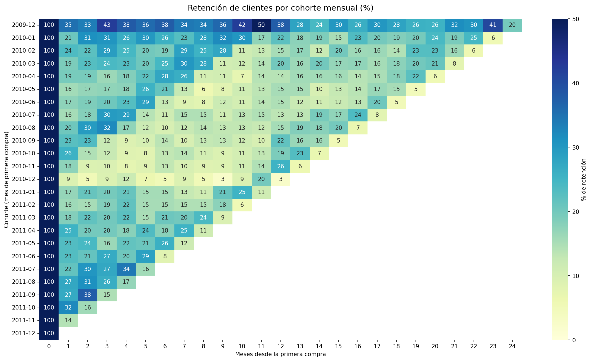
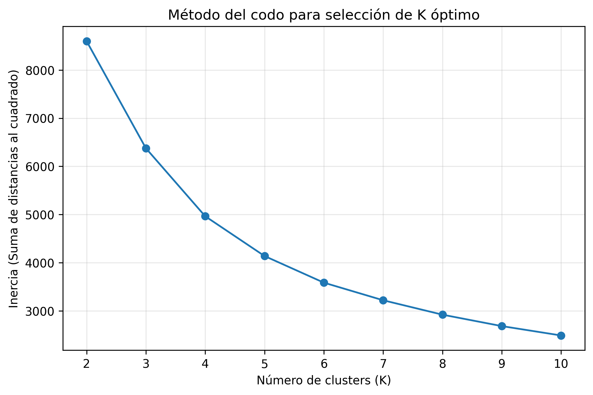
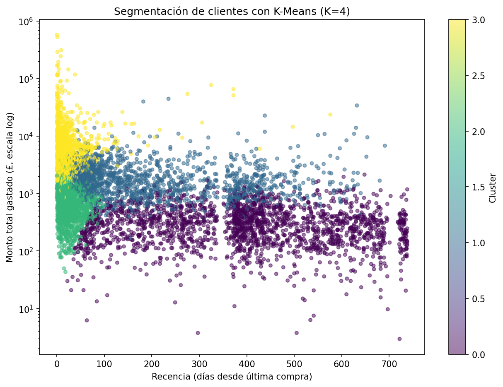

# Ecommerce Customer Analytics: Segmentación RFM y Clustering con K-Means

Este proyecto implementa un sistema de análisis de comportamiento de clientes para una plataforma de comercio electrónico internacional. El objetivo es transformar datos transaccionales masivos en segmentos estratégicos mediante reglas lógicas de negocio y la validación de un algoritmo de aprendizaje no supervisado.

## 📊 Contexto del Dataset
Se trabajó con el dataset público **Online Retail II** del Repositorio de Machine Learning de la UCI. Este registro contiene todas las transacciones de una empresa de retail registrada en el Reino Unido entre diciembre de 2009 y diciembre de 2011.
* **Volumen inicial:** 1.067.371 filas.
* **Alcance:** 2 años de historial transaccional, 41 países y £17,3M en facturación total.

## 🔍 Control de Calidad de Datos (Data Profiling)
Como paso previo al análisis, se desarrolló un pipeline de limpieza en Python para auditar la integridad de la base y mitigar anomalías que pudieran sesgar los resultados:

| Anomalía Detectada | Impacto Numérico | Tratamiento Aplicado | Justificación Técnica |
| :--- | :---: | :--- | :--- |
| **Registros Duplicados** | 34.335 filas | Eliminación con `.drop_duplicates()` | Remoción de transacciones idénticas repetidas por el sistema. |
| **Clientes Anónimos** | 243.007 filas | Exclusión con `.dropna(subset=['Customer ID'])` | Registros sin ID que impiden trazar el historial del usuario. |
| **Facturas Canceladas** | 19.494 filas | Exclusión mediante negación lógica (`~`) | Devoluciones identificadas con la letra 'C' que alteran las ventas netas. |
| **Cantidades Inválidas**| 22.950 filas | Filtrado de valores menores o iguales a cero | Registros correspondientes a ajustes de stock o errores de carga. |
| **Precios Inválidos** | 6.207 filas | Filtrado de valores menores o iguales a cero | Registros huérfanos o artículos sin valor comercial. |

* **Resultado del proceso:** El dataset se depuró a un volumen de **779.425 transacciones válidas**, excluyendo de forma justificada el 27% del total original.

## 🛠️ Metodología y Arquitectura
El proyecto se dividió en fases lógicas para asegurar la reproducibilidad del análisis:
1. **Manipulación de Datos (Pandas):** Carga, decodificación de caracteres (`latin-1`) y ejecución del pipeline de limpieza.
2. **Persistencia (SQLite):** Traspaso de los datos limpios a una base de datos relacional local (`retail.db`) para independizar el cómputo del archivo plano.
3. **Métricas RFM (SQL):** Uso de Expresiones de Tabla Común (CTEs) y funciones de agregación (`COUNT(DISTINCT)`, `MAX`, `SUM`) para calcular la Recencia, Frecuencia y el Monto, consolidando la información en una matriz de 5.878 clientes únicos.
4. **Análisis de Cohortes (Python/SQL):** Agrupación cronológica de clientes por su mes de debut para evaluar el comportamiento de retención en el tiempo.
5. **Agrupación Avanzada (K-Means):** Estabilización de la varianza mediante transformación logarítmica (`log1p`) y estandarización de escalas (`StandardScaler`) antes de evaluar el número óptimo de clusters y entrenar el modelo.

## 📈 Hallazgos Principales e Insights de Negocio

### 1. Concentración de Facturación (Análisis por Reglas)
El análisis inicial reflejó una fuerte asimetría en la cartera: el segmento de clientes clasificado manualmente como **"Campeones"** representa únicamente el **22.8%** de la base de usuarios, pero concentra el **69% de la facturación total** (£11,9M).

### 2. Comportamiento de Retención y Estacionalidad
El análisis de cohortes demostró que la cohorte inicial de diciembre de 2009 retiene un ~35% de sus clientes al primer mes, mientras que las cohortes posteriores promedian entre un 20% y un 25%. Sin embargo, se identificó un patrón estacional crítico: en el mes 11 de seguimiento (noviembre de 2010), la retención de la cohorte inicial repuntó al **49.5%**, evidenciando una fuerte reactivación motivada por las compras pre-navideñas.



### 3. Contraste de Modelos: Reglas de Negocio vs. K-Means
Para determinar el número óptimo de clusters ($K$), se evaluó la inercia del modelo mediante el método del codo, identificando un punto de quiebre claro en $K=4$.



El algoritmo K-Means ($K=4$) validó los extremos de la segmentación manual (99% de coincidencia en clientes "Perdidos") pero aportó mayor profundidad analítica en las zonas grises:
* **Segmentación de Leales:** Las reglas tradicionales agrupaban a 1.364 clientes como "Leales". El algoritmo identificó una división crítica dentro de este grupo: 596 se mantenían activos y estables (Cluster 2), mientras que **650 clientes que acumulan £3,1M de facturación histórica ya mostraban ~7 meses de inactividad** (Cluster 1), requiriendo acciones prioritarias de reactivación.



## 💻 Stack Tecnológico
* **Lenguaje:** Python 3.14
* **Librerías Principales:** Pandas, NumPy, Scikit-Learn
* **Entorno de Base de Datos:** SQLite3
* **Visualización:** Matplotlib, Seaborn

## 🚀 Cómo Reproducir el Proyecto

1. Clonar el repositorio de forma local:
   ```bash
   git clone https://github.com/edugovea/Proyectos-Personales-Auditoria-Analisis-de-datos-y-Machine-Learning.git
   ```

2. Ingresar a la carpeta del proyecto:
   ```bash
   cd Proyectos-Personales-Auditoria-Analisis-de-datos-y-Machine-Learning/01-ecommerce-customer-analytics
   ```

3. Crear y activar un entorno virtual:
   ```bash
   python -m venv .venv
   # Windows
   .venv\Scripts\activate
   # Linux / Mac
   source .venv/bin/activate
   ```

4. Instalar las dependencias:
   ```bash
   pip install -r requirements.txt
   ```

5. Abrir y ejecutar el notebook de análisis:
   ```bash
   jupyter notebook notebooks/01_exploracion_limpieza.ipynb
   ```

> El dataset **Online Retail II** no se versiona en el repositorio por su tamaño. Descargarlo del [UCI Machine Learning Repository](https://archive.ics.uci.edu/dataset/502/online+retail+ii) y colocarlo en la ruta esperada por el notebook.