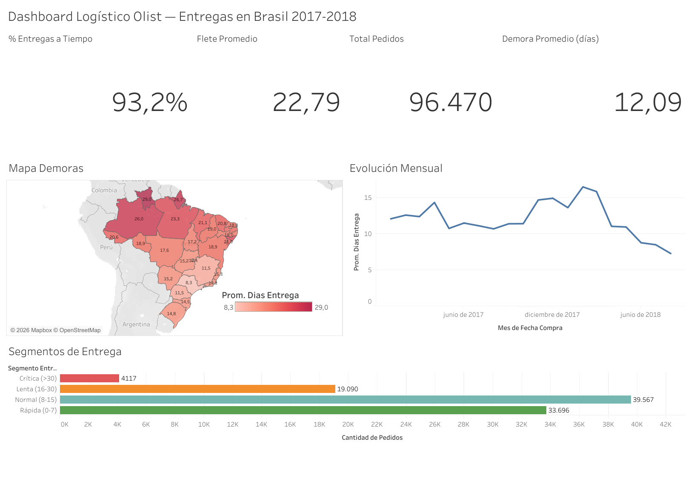

## 🧭 Resumen ejecutivo

Este proyecto construye un dashboard logístico en Tableau Public a partir del dataset público de Olist. La preparación de datos se realiza con un pipeline reproducible en Python/Pandas (`data_preparation.py`), que consolida información de pedidos, clientes e ítems en una tabla analítica final utilizada como fuente única por Tableau.

La solución separa claramente dos capas: **Python prepara los datos y Tableau presenta los resultados**. Esto permite que las reglas de transformación, los filtros aplicados, las métricas logísticas y los criterios de calidad de datos queden documentados y versionados junto al dashboard.

El principal aporte analítico es distinguir entre **velocidad de entrega** y **confiabilidad logística**. Algunos estados presentan mayores tiempos promedio por distancia o complejidad geográfica, pero cumplen el plazo prometido; otros muestran incumplimientos aun con tiempos menos extremos. El dashboard separa ambas dimensiones para evitar conclusiones simplistas.

# 📦 Dashboard Logístico Olist — Entregas en Brasil 2017-2018

Dashboard interactivo en Tableau Public para monitorear la cadena de entrega del
e-commerce brasileño Olist: tiempos reales vs prometidos, demoras por región,
segmentación de entregas y costos de flete.

🔗 **[Ver dashboard interactivo en Tableau Public](https://public.tableau.com/app/profile/eduardo.govea/viz/DashboardLogsticoOlist/DashboardLogsticoOlistEntregasenBrasil2017-2018)**



---

## 🎯 Objetivo

Convertir ~100.000 pedidos distribuidos en 9 tablas relacionales en un dashboard
ejecutivo que permita responder rápidamente preguntas clave de gestión logística:

- ¿Cuánto tarda la operación en entregar?
- ¿Se cumple la fecha prometida al cliente?
- ¿Dónde se concentran las mayores demoras?
- ¿Qué estados presentan peor desempeño logístico?
- ¿Cómo evoluciona el cumplimiento a lo largo del tiempo?

El proyecto está construido con separación clara entre capa de datos y capa de visualización:
Python prepara una tabla analítica reproducible y Tableau la utiliza como fuente única para el dashboard.

---

## 🛠️ Stack

- **Python / Pandas** — limpieza, validación, joins y cálculo de métricas.
- **Tableau Public** — visualización, segmentación y análisis ejecutivo.
- **Dataset:** [Brazilian E-Commerce Public Dataset by Olist (Kaggle)](https://www.kaggle.com/datasets/olistbr/brazilian-ecommerce)

---

🧱 Estructura del proyecto
02-dashboard-logistica-tableau/
│
├── img/
│   └── dashboard.png
│
├── .gitignore
├── 01_exploracion.ipynb
├── README.md
├── data_preparation.py
└── requirements.txt

Los CSVs crudos del dataset Olist no se versionan en GitHub por tamaño y porque pertenecen a una fuente externa.
Para reproducir el pipeline, crear localmente una carpeta data/, ubicar allí los CSVs requeridos y ejecutar python data_preparation.py.
El script generará localmente data/pedidos_logistica.csv, archivo utilizado como fuente única para Tableau.

---

## ⚙️ Pipeline end-to-end

El proyecto documenta de forma explícita el flujo completo desde datos crudos hasta dashboard:

```text
CSVs crudos Olist
        ↓
data_preparation.py
        ↓
Validación, limpieza, joins y cálculo de métricas logísticas
        ↓
data/pedidos_logistica.csv
        ↓
Tableau Public
        ↓
Dashboard logístico interactivo
```

### 1. Fuente de datos

El proyecto utiliza el dataset público **Brazilian E-Commerce Public Dataset by Olist**, disponible en Kaggle.

Tablas utilizadas por el pipeline:

| Archivo | Uso dentro del pipeline |
|---|---|
| `olist_orders_dataset.csv` | Estado del pedido y fechas del ciclo logístico |
| `olist_customers_dataset.csv` | Ciudad y estado del cliente |
| `olist_order_items_dataset.csv` | Cantidad de ítems, valor de productos y costo de flete |

Aunque el dataset completo contiene más tablas, este dashboard utiliza solo las necesarias para el análisis logístico principal.

---

### 2. Preparación con Python

El script `data_preparation.py` ejecuta el proceso completo de preparación de datos:

1. Verifica que existan los CSVs requeridos.
2. Carga las tablas crudas desde la carpeta `data/`.
3. Convierte columnas de fecha a formato `datetime`.
4. Filtra pedidos con estado `delivered` y fecha real de entrega válida.
5. Calcula métricas logísticas:
   - `dias_entrega`
   - `dias_prometidos`
   - `dias_vs_promesa`
   - `entrega_a_tiempo`
6. Incorpora la dimensión geográfica del cliente:
   - `estado`
   - `ciudad`
7. Agrega información económica y operativa por pedido:
   - `cantidad_items`
   - `valor_productos`
   - `costo_flete`
8. Segmenta las entregas en:
   - Rápida
   - Normal
   - Lenta
   - Crítica
9. Exporta una tabla plana final en español: `data/pedidos_logistica.csv`.

---

### 3. Salida del pipeline

El archivo final utilizado por Tableau es:

```text
data/pedidos_logistica.csv
```

Esto permite mantener una separación clara entre:

- datos crudos,
- transformación,
- dataset analítico,
- visualización final.

---

## 🔁 Reproducibilidad

Para reproducir el proyecto desde cero:

```bash
# 1. Clonar el repositorio
git clone https://github.com/edugovea/Proyectos-Personales-Auditoria-Analisis-de-datos-y-Machine-Learning.git

# 2. Ingresar al proyecto
cd Proyectos-Personales-Auditoria-Analisis-de-datos-y-Machine-Learning/02-dashboard-logistica-tableau

# 3. Crear entorno virtual
python -m venv venv

# 4. Activar entorno virtual
# Windows
venv\Scripts\activate

# Linux / Mac
source venv/bin/activate

# 5. Instalar dependencias
pip install -r requirements.txt

# 6. Descargar el dataset desde Kaggle y ubicar los CSVs requeridos en /data

# 7. Ejecutar el pipeline
python data_preparation.py
```

Resultado esperado:

```text
Exportado .../data/pedidos_logistica.csv: 96470 filas, 14 columnas
Demora promedio: 12.1 días
% entregas a tiempo: 93.2%
```

---

## 📊 Uso en Tableau

El dashboard fue construido en Tableau Public utilizando como fuente única:

```text
data/pedidos_logistica.csv
```

Esto permite que la lógica de transformación permanezca documentada y versionada en Python, mientras Tableau se concentra en la capa visual e interactiva.

---

## 🔍 Control de calidad de datos

Con mirada de auditoría de datos, antes de visualizar se verificó la consistencia interna del dataset.

| # | Hallazgo | Tratamiento |
|---|----------|-------------|
| 1 | 8 pedidos en estado `delivered` sin fecha de entrega | Excluidos de las métricas de tiempo |
| 2 | 6 pedidos `canceled` con fecha de entrega | Permanecen como cancelados: prevalece el estado final del negocio |
| 3 | 7 de los 10 pedidos más demorados fueron registrados como entregados el mismo día, con compras de meses anteriores | Se conservan y documentan como outliers relevantes |
| 4 | Los meses de 2016 tienen volumen bajo y pueden distorsionar promedios | 2016 se excluye de la serie temporal principal |

Lección general: el estado declarado y los timestamps pueden contradecirse. Por eso el pipeline combina estado del pedido y existencia de fecha real de entrega en lugar de confiar en un único campo.

---

## 📈 Insights principales

- **Brecha geográfica:** São Paulo recibe en 8,3 días promedio; Roraima en 29 días.
- **Velocidad y confiabilidad no son lo mismo:** estados remotos pueden ser lentos pero cumplir la promesa si el plazo prometido es mayor.
- **Crisis y recuperación:** la demora aumentó entre noviembre de 2017 y marzo de 2018, y luego mejoró de forma sostenida.
- **Distribución general:** 93,2% de entregas a tiempo; solo 4,3% de pedidos superan los 30 días.

---

## ⚠️ Limitaciones del análisis

- El dataset es público, histórico y anonimizado.
- No se dispone de información operativa interna de transportistas.
- No se puede verificar si algunos registros representan entrega real o cierre administrativo.
- El dashboard analiza desempeño logístico descriptivo; no predice demoras futuras.
- Las conclusiones deben interpretarse dentro del periodo y alcance del dataset.

---

## 🧾 Valor profesional del proyecto

Este proyecto demuestra:

- Preparación reproducible de datos con Python.
- Separación entre capa de transformación y capa de visualización.
- Uso de Tableau para storytelling ejecutivo.
- Criterio de auditoría aplicado a calidad de datos.
- Documentación de hallazgos, tratamientos y limitaciones.
- Construcción de una salida analítica defendible y versionada.
