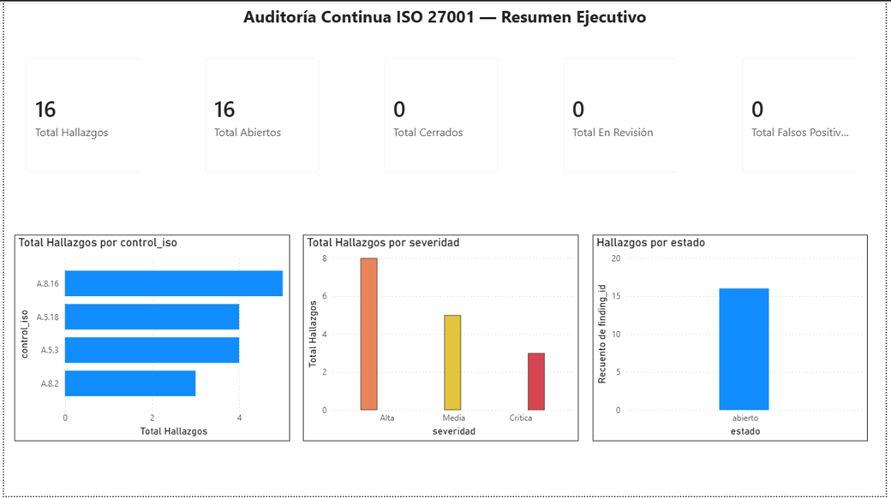
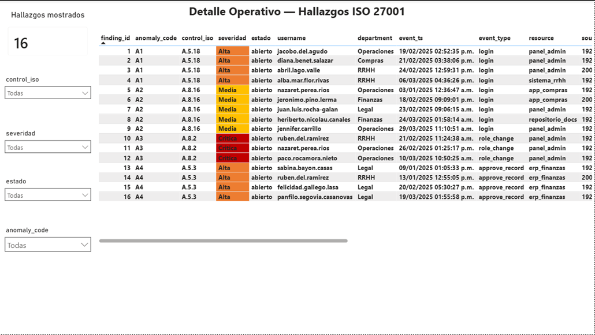

# 🔐 Auditoría Continua ISO 27001 — Motor de Detección sobre Logs de Acceso

Sistema de auditoría continua sobre logs de acceso sintéticos, orientado a detectar posibles no conformidades vinculadas a controles de ISO/IEC 27001:2022.

El proyecto combina generación de eventos, análisis en PostgreSQL, motor de detección SQL, registro de hallazgos con trazabilidad y validación automatizada con `pytest`.

---

## 🧭 Resumen ejecutivo

Este proyecto simula un escenario de auditoría continua sobre eventos de acceso. A partir de logs sintéticos generados con ruido operativo y casos ambiguos, el sistema detecta patrones compatibles con posibles incumplimientos de controles de seguridad de la información.

La solución separa claramente tres capas: **Python genera los datos**, **PostgreSQL ejecuta el motor de detección** y **Power BI queda previsto como capa de presentación ejecutiva/operativa**.

El foco del proyecto no está en construir una infraestructura compleja, sino en demostrar criterio de auditoría aplicado a datos:

* detección de anomalías relevantes;
* trazabilidad entre evento, hallazgo y control ISO;
* preservación de la integridad de la evidencia;
* validación automatizada del motor de detección.

El MVP trabaja sobre PostgreSQL nativo, priorizando simplicidad, trazabilidad y foco en el motor de detección.

---

## 🎯 Objetivo

Construir un motor reproducible de auditoría continua que permita:

* generar logs de acceso sintéticos;
* inyectar casos de incumplimiento controlados;
* detectar anomalías mediante funciones SQL en PostgreSQL;
* registrar hallazgos con severidad, evidencia y trazabilidad;
* mapear cada anomalía a controles de ISO/IEC 27001:2022;
* validar el comportamiento del motor mediante tests automatizados.

El proyecto busca transformar eventos técnicos en hallazgos con sentido de auditoría, cumplimiento y control interno.

---

## 🛠️ Stack

* **Python** — generación de logs sintéticos y soporte de pruebas.
* **PostgreSQL** — almacenamiento, análisis y motor de detección.
* **SQL / PLpgSQL** — funciones de detección, orquestación y controles.
* **pytest** — validación automatizada del motor.
* **Power BI** — visualización ejecutiva y operativa sobre vistas SQL.
* **Jira** — planificación y gestión del proyecto.

---

## 🧱 Estructura del proyecto

```text
03-auditoria-continua-iso27001/
│
├── db/
│   ├── init/            # esquema base: tablas + findings con trigger de inmutabilidad
│   └── motor/           # funciones de detección (A1–A4), orquestadora y vistas Power BI
│
├── generador/           # generación de logs sintéticos con ruido y ground truth
│
├── tests/               # pruebas automatizadas del motor (pytest)
│
├── docs/
│   └── img/             # capturas de los dashboards
│
├── powerbi/
│   └── dashboard_auditoria_iso27001.pbix
│
├── .env.example
├── .gitignore
├── docker-compose.yml   # artefacto opcional de reproducibilidad (Docker diferido)
├── pytest.ini
├── requirements.txt
└── README.md
```

> El archivo `.env` no se versiona. Para configurar el entorno local, usar `.env.example` como plantilla.

---

## ⚙️ Pipeline end-to-end

El proyecto documenta de forma explícita el flujo completo desde generación de eventos hasta hallazgos auditables:

```text
Generador Python
        ↓
Logs sintéticos con ruido operativo y casos ambiguos
        ↓
Carga en PostgreSQL
        ↓
Motor SQL de detección
        ↓
Tabla findings
        ↓
Severidad + evidencia + control ISO
        ↓
Validación con pytest
        ↓
Dashboard Power BI
```

### 1. Fuente de datos

A diferencia de los proyectos basados en datasets públicos, este proyecto utiliza datos sintéticos generados específicamente para simular eventos de acceso.

El generador produce:

* eventos normales;
* ruido operativo;
* casos ambiguos;
* casos de incumplimiento controlados;
* verdad conocida o `ground truth` para validar el motor.

Esto permite probar el sistema con escenarios conocidos y verificar si las reglas de detección funcionan correctamente.

---

### 2. Generación y carga de datos

La capa de generación produce logs de acceso sintéticos con casos realistas y no solamente anomalías limpias.

El objetivo es que el motor tenga que distinguir entre:

* eventos normales;
* eventos atípicos pero no necesariamente incumplimientos;
* eventos que sí deben convertirse en hallazgos;
* casos ambiguos que requieren criterio de control.

Los datos generados se cargan en PostgreSQL, donde son analizados por el motor SQL.

---

### 3. Motor de detección en PostgreSQL

El motor de detección analiza los eventos de acceso mediante funciones SQL y registra los resultados en una tabla de hallazgos.

Cada hallazgo conserva:

* identificador del hallazgo;
* tipo de anomalía;
* usuario o entidad involucrada;
* control ISO asociado;
* severidad;
* evidencia;
* estado;
* fecha de detección.

La tabla `findings` cuenta con un trigger de inmutabilidad: una vez registrado, un hallazgo no puede modificarse ni eliminarse. Esto preserva la integridad de la evidencia generada por el proceso de auditoría.

---

## 🧩 Tipos de anomalías detectadas

El motor trabaja sobre cuatro escenarios principales:

| Anomalía                              | Descripción                                                 | Control ISO 27001:2022 |
| ------------------------------------- | ----------------------------------------------------------- | ---------------------- |
| Acceso post-baja                      | Usuario con fecha de baja registra accesos posteriores      | A.5.18                 |
| Horario anómalo                       | Accesos fuera de horarios esperados                         | A.8.16                 |
| Escalamiento de privilegios           | Cambio o uso de privilegios elevados no esperado            | A.8.2                  |
| Violación de segregación de funciones | Usuario concentra acciones incompatibles dentro del proceso | A.5.3                  |

El objetivo no es detectar “eventos raros” sin contexto, sino transformar eventos técnicos en hallazgos con sentido de auditoría y cumplimiento.

---

## 🔁 Reproducibilidad

Para reproducir el proyecto desde cero:

```bash
# 1. Clonar el repositorio
git clone https://github.com/edugovea/Proyectos-Personales-Auditoria-Analisis-de-datos-y-Machine-Learning.git

# 2. Ingresar al proyecto
cd Proyectos-Personales-Auditoria-Analisis-de-datos-y-Machine-Learning/03-auditoria-continua-iso27001

# 3. Crear entorno virtual
python -m venv .venv

# 4. Activar entorno virtual
# Windows
.venv\Scripts\activate

# Linux / Mac
source .venv/bin/activate

# 5. Instalar dependencias
pip install -r requirements.txt

# 6. Crear archivo .env a partir de .env.example
#    (completar DATABASE_URL con la conexión a PostgreSQL local)

# 7. Preparar la base de datos
#    Se crea el rol y la base, y se cargan los scripts CONECTADO COMO 'auditor'
#    para que los objetos queden a su nombre (evita problemas de permisos):
psql -U postgres -c "CREATE ROLE auditor LOGIN PASSWORD 'tu_clave';"
psql -U postgres -c "CREATE DATABASE iso27001 OWNER auditor;"

# esquema base (db/init)
psql -U auditor -d iso27001 -f db/init/01_schema.sql
psql -U auditor -d iso27001 -f db/init/02_findings.sql

# motor de detección y vistas (db/motor)
psql -U auditor -d iso27001 -f db/motor/10_fn_detectar_a1.sql
psql -U auditor -d iso27001 -f db/motor/11_fn_detectar_a2.sql
psql -U auditor -d iso27001 -f db/motor/12_fn_detectar_a3.sql
psql -U auditor -d iso27001 -f db/motor/13_fn_detectar_a4.sql
psql -U auditor -d iso27001 -f db/motor/20_sp_ejecutar_auditoria.sql
psql -U auditor -d iso27001 -f db/motor/30_vistas_powerbi.sql

# 8. Ejecutar tests (regenera datos, corre el motor y valida)
pytest
```

Resultado esperado:

```text
Los tests automatizados validan la generación de datos, la ejecución del motor de detección, la consistencia de los hallazgos y el mapeo con controles ISO.
```

---

## 📊 Visualización en Power BI

Power BI funciona como capa de presentación sobre el motor, conectándose por **Import** a dos vistas SQL: `vw_resumen_ejecutivo` (agregada) y `vw_detalle_hallazgos` (fila por hallazgo). La detección vive en la base; el dashboard solo lee. Esa separación es deliberada: la verdad está en PostgreSQL, no en el tablero.

### Dashboard ejecutivo

Responde *cuánto y de qué tipo*: KPIs de hallazgos por estado (total, abiertos, en revisión, cerrados, falsos positivos) y gráficos por control ISO, por severidad y por estado. El color codifica gravedad (no decora).



### Dashboard operativo

Permite trabajar el hallazgo caso por caso: tabla de detalle con la evidencia de cada hallazgo, filtros por control ISO, severidad, estado y tipo de anomalía, una tarjeta de conteo que reacciona a los filtros y resaltado de severidad por color para triage rápido.



> El archivo `.pbix` se incluye en `powerbi/`. Como se conecta a la base local por las dos vistas, es reproducible: basta reconstruir la base (ver Reproducibilidad) y refrescar la conexión con el rol `auditor`.

---

## 🔍 Control de calidad y criterio de auditoría

Con mirada de auditoría, el proyecto no se limita a detectar eventos aislados. Busca preservar trazabilidad entre dato, regla de detección, hallazgo y control asociado.

| Control aplicado                 | Propósito                                               |
| -------------------------------- | ------------------------------------------------------- |
| Generación de `ground truth`     | Permite validar si el motor detecta los casos esperados |
| Ruido operativo y casos ambiguos | Evita probar el motor solo contra anomalías limpias     |
| Mapeo anomalía → control ISO     | Da sentido de cumplimiento a la detección               |
| Tabla `findings`                 | Centraliza los hallazgos detectados                     |
| Trigger de inmutabilidad         | Protege la integridad de la evidencia                   |
| Tests automatizados              | Verifican consistencia del motor de detección           |

Lección general: en auditoría de datos, detectar una anomalía no alcanza. Es necesario documentar evidencia, criterio, severidad, control afectado y trazabilidad del hallazgo.

---

## 📈 Aportes principales

* **Auditoría continua:** el proyecto simula un proceso de detección recurrente sobre eventos de acceso.
* **Trazabilidad:** cada hallazgo queda asociado a evidencia y control ISO.
* **Integridad de evidencia:** el trigger de inmutabilidad evita modificaciones posteriores sobre hallazgos registrados.
* **Validación automatizada:** los tests verifican el comportamiento del motor contra casos conocidos.
* **Criterio de cumplimiento:** las anomalías se interpretan en relación con controles ISO 27001:2022, no como simples eventos técnicos.

---

## ⚠️ Limitaciones del análisis

* Los datos son sintéticos y no representan logs reales de una organización.
* El proyecto no reemplaza una auditoría formal ni una herramienta SIEM.
* La detección se basa en reglas definidas para el MVP.
* Las conclusiones deben interpretarse dentro del alcance del dataset sintético y las reglas implementadas.

---

## ✅ Estado del proyecto

✅ **Completo (MVP)**

Estado actual:

* Motor SQL finalizado.
* Generador de logs implementado.
* Tabla `findings` y trigger de inmutabilidad implementados.
* Tests automatizados implementados.
* Dashboards Power BI ejecutivo y operativo construidos y documentados.

---

## 🧾 Valor profesional del proyecto

Este proyecto demuestra:

* criterio de auditoría aplicado a datos;
* diseño de controles de integridad sobre evidencia;
* modelado de hallazgos con trazabilidad;
* uso de PostgreSQL como motor analítico y de control;
* validación automatizada de reglas de detección;
* documentación técnica clara del alcance, criterios de detección y validaciones;
* transición desde análisis descriptivo hacia detección industrializada.
