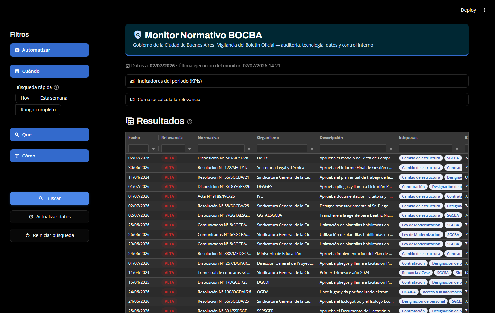
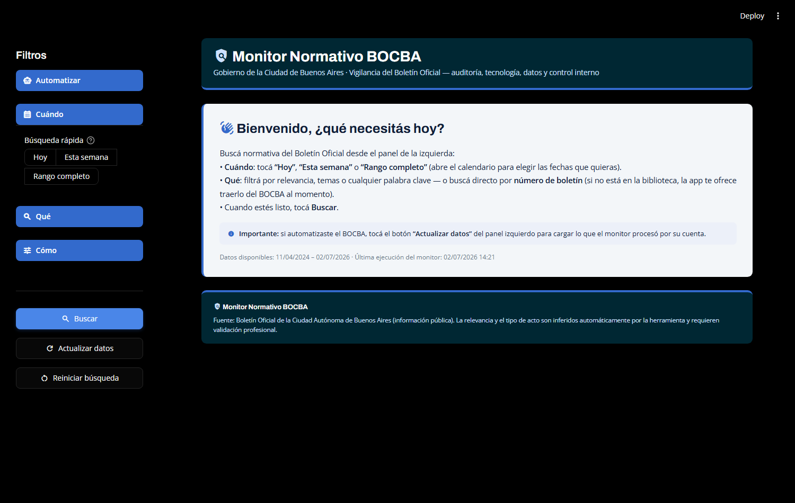
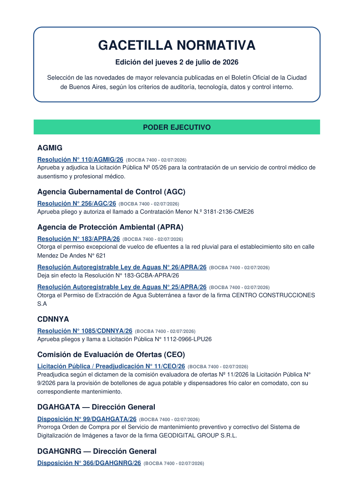
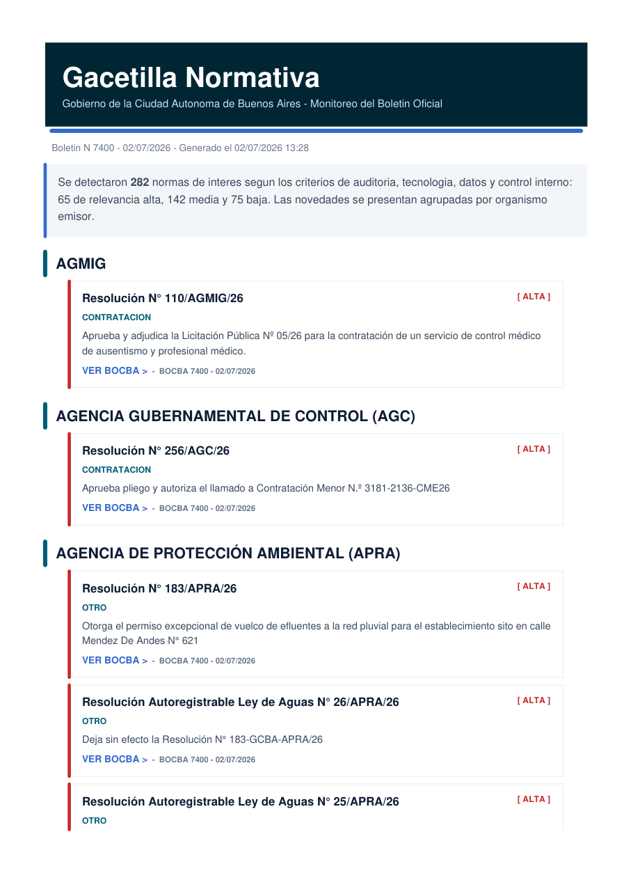
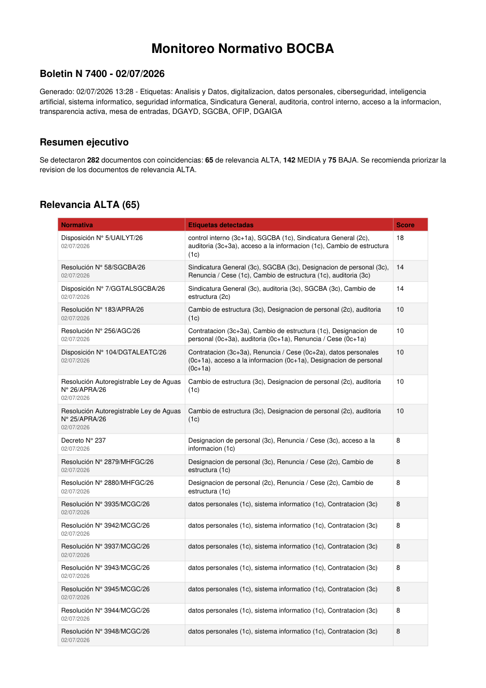

# 🔎 05 - Monitor Normativo BOCBA

✅ **Estado:** funcional — motor de vigilancia, buscador histórico y tablero web operativos, en evolución continua.

## Qué es

Herramienta de **vigilancia y búsqueda de normativa** publicada en el Boletín Oficial de la Ciudad de Buenos Aires (BOCBA), pensada desde la lógica del auditor: convierte publicaciones normativas dispersas en información consultable, filtrable y documentada, con un **criterio de relevancia explicable** orientado a auditoría, tecnología, datos y control interno.

En lugar de depender de buscadores con retraso de indexación, consulta la **API REST oficial del Boletín**, enumera todos los documentos publicados cada día, descarga los PDFs, extrae su texto y busca directamente sobre lo que realmente salió publicado.

El usuario de referencia es un **equipo legal / de control** que necesita una gacetilla diaria o semanal de novedades normativas: los criterios de qué vigilar y qué priorizar se calibraron con el pedido real de un área legal (leyes, designaciones de alto rango, cambios de estructura, informes finales de gestión y materias sensibles).



## Componentes

| Archivo | Qué hace |
|---|---|
| `monitor_bocba_v2.py` | **El motor.** Consulta la API por fecha o rango, descarga los PDFs en paralelo (con caché y reintentos), extrae texto con PyMuPDF, busca keywords/siglas/sinónimos y clasifica cada norma con la matriz de riesgo. Genera reporte JSON, informe ejecutivo PDF y gacetilla PDF, y archiva los PDFs de las normas detectadas. Omite automáticamente los días sin boletín propio (fines de semana/feriados). |
| `app.py` | **El tablero (Streamlit).** Pantalla de bienvenida, filtros por fecha (Hoy / Esta semana / Rango con calendario), relevancia, temas, palabra clave y N° de boletín; tabla tipo Excel (AgGrid) con badges, filtros por columna insensibles a tildes y selección de filas; KPIs, gráfico por día, detalle de menciones con página y contexto; descarga de CSV y de la gacetilla filtrada en PDF; y activación de la **automatización diaria** (Programador de tareas de Windows) desde la propia interfaz. |
| `buscar_bocba.py` | **Búsqueda por número de boletín.** La API solo consulta por fecha, así que resuelve iterativamente a qué fecha corresponde el número pedido. Alcance histórico comprobado (boletines de 2024). Analiza el boletín completo con el criterio del monitor o busca una palabra puntual; genera gacetilla PDF y deja el reporte disponible para la app. |
| `buscar_palabra.py` | Búsqueda rápida de una palabra o frase libre en el boletín de hoy (o una fecha dada), reutilizando caché y motor. |

## El criterio de relevancia: matriz de riesgo por materia

La decisión de diseño central del proyecto. En vez de puntuar por volumen de menciones (que convierte cualquier tanda de designaciones en falsa alarma), la clasificación parte del **piso de riesgo de la materia** — el tema define de dónde nace cada norma — y se ajusta con reglas y agravantes:

1. **Piso por materia** (editable en `PISOS`): datos personales, ciberseguridad, control interno, auditoría o transparencia *nacen* en ALTA; contrataciones, IA o sistemas en MEDIA; designaciones y ceses de rutina en BAJA.
2. **Reglas del usuario final:** las Leyes y las designaciones/renuncias de Director General "para arriba" son siempre ALTA.
3. **Anti-boilerplate:** una materia de piso ALTA solo lo activa con mención *sustantiva* (el tema está en el sumario o se repite en el cuerpo) — una mención suelta suele ser cláusula estándar de contrato, no una norma *sobre* el tema.
4. **Agravantes acotados:** el score (menciones en cuerpo, cantidad, ubicación) puede subir la norma **un solo nivel** — el volumen nunca fabrica una ALTA — y ordena los resultados dentro de cada nivel.

El resultado es un criterio **explicable y defendible**: "es ALTA porque trata datos personales en el cuerpo normativo" es una frase que se puede sostener ante cualquiera. La calibración se validó reclasificando el histórico completo y revisando la distribución resultante.

## Stack técnico

* **Python** — requests, PyMuPDF (`fitz`), ReportLab, pandas
* **Streamlit** + **streamlit-aggrid** para el tablero (identidad visual basada en el sistema de diseño Obelisco V2 del GCBA)
* Persistencia en **JSON + caché de texto** (decisión deliberada: simple, portable y auditable a esta escala; migrar a PostgreSQL es evolución posible, no necesidad actual)
* Automatización con el **Programador de tareas de Windows**

```powershell
py -m pip install -r requirements.txt
```

## Cómo se usa

```powershell
# El tablero web
py -m streamlit run app.py

# Vigilancia por fecha
py -X utf8 monitor_bocba_v2.py                          # boletín de hoy
py -X utf8 monitor_bocba_v2.py 24-06-2026               # fecha puntual
py -X utf8 monitor_bocba_v2.py 24-06-2026 01-07-2026    # rango (inclusive)

# Búsqueda por número de boletín
py -X utf8 buscar_bocba.py 7394                    # boletín completo
py -X utf8 buscar_bocba.py 6850 "obra publica"     # una palabra/frase en ese boletín

# Búsqueda de una palabra en el boletín de hoy
py -X utf8 buscar_palabra.py "datos personales"
```

Cada corrida deja en `reportes_bocba/` (carpeta local, excluida del repo): el reporte JSON que alimenta la app, los PDFs de salida, el caché de texto (que hace casi instantáneas las búsquedas repetidas) y copia de las normas detectadas.

La app arranca con una pantalla de bienvenida y el usuario decide qué buscar:



## Salidas en PDF

Tres productos por corrida — la **edición institucional** (curada, solo relevancia ALTA, lista para circular por mail), la **gacetilla completa** agrupada por organismo con identidad Obelisco, y el **informe ejecutivo** con tablas por nivel:

<p align="center">
  
  
  
</p>

## Roadmap

* **Feedback del auditor:** botón en la app para marcar alertas como útiles/no útiles — construye el dataset etiquetado.
* **Clasificador ML** (TF-IDF + scikit-learn, o embeddings) entrenado con ese feedback, como módulo opcional con *fallback* a la matriz de reglas — la relevancia nunca deja de ser explicable.
* Búsqueda en vivo (por palabra o número de boletín) directamente desde el tablero.
* Ajuste continuo de la matriz de materias y del diccionario de organismos según el uso real.

## Transparencia: rol de la IA en este proyecto

Este proyecto fue desarrollado **con asistencia de IA** (Claude, de Anthropic). En particular, la interfaz web — el front-end, el CSS y el JavaScript de la tabla — fue escrita por IA, ya que no es mi especialidad. Las decisiones que definen la herramienta son propias: el enfoque de auditoría, la matriz de riesgo por materia, los criterios del área usuaria, la selección de qué vigilar y la validación de resultados contra datos reales. Lo documento porque la transparencia metodológica es parte del oficio de auditar.

## Aviso

Proyecto **personal, educativo y demostrativo**. No es una herramienta oficial del Gobierno de la Ciudad de Buenos Aires ni contiene información interna, reservada o confidencial. Toda la información proviene de fuentes públicas (la API pública del Boletín Oficial). La relevancia y el tipo de acto son inferidos automáticamente y requieren validación profesional.
